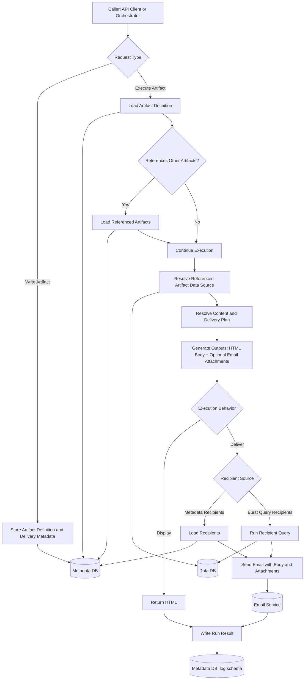

# BCI Query Engine Blueprint

Status: Draft v0.3
Date: 2026-05-22
Owners: Platform Engineering, Data Engineering

## 1. Purpose

Define the canonical functional model for the Query Engine before deeper implementation continues.

This blueprint is the main design reference for the current phase.

## 2. Locked Design Decisions

The following points are treated as agreed for the current phase:

1. The Query Engine has two top-level responsibilities: write artifact definitions into metadata, and execute artifact definitions from metadata.
2. Display output is HTML-only for now.
3. PDF, XLSX, CSV, and TXT are delivery-only attachment formats.
4. Artifact mode and delivery configuration live in the metadata database.
5. Execution logging lives in the metadata database.
6. The metadata database starts with `app`, `security`, and `log` schemas.
7. Burst-specific control tables should not live in the SRP data database.
8. Data queries run before content resolution.
9. Receiving a display artifact should be a `GET`, not a `POST`.
10. An artifact owns its data-source definition.
11. Delivery is best treated as an execution behavior over an artifact, not as a fundamentally separate content type.

## 3. Canonical Flow

## 3A. Canonical API Shape

If an artifact is being received for display, the canonical access pattern should be `GET`.

Recommended direction:

1. `POST /artifacts`
	Create or update artifact definitions in metadata.
2. `GET /artifacts/{client_key}/{artifact_key}`
	Return the rendered HTML for the artifact.
3. `POST /artifact-executions`
	Create an execution request for an artifact. The artifact definition provides the data source and content rules; the execution request may ask for display or delivery behavior.

Design rule:

1. `GET` is for retrieving a display artifact.
2. `POST` is for writes or for creating an execution request.
3. Artifact behavior should come from metadata, not from route names like `deliver`, `run`, or `render`.
4. If runtime overrides or filter payloads are later needed in a request body, they belong on the execution request payload, not on the normal display retrieval path.

## 4. Artifact Model

An artifact is a metadata-backed definition that can:

1. describe its data source
2. reference templates or content
3. reference other artifacts
4. define output rules
5. define how it should be executed when called

Core rule:

1. The artifact itself owns the data-source definition that the query engine uses to formulate the database request.
2. A referenced artifact brings its own source metadata with it.
3. A delivery request should be able to call a referenced artifact, render it, and then send the rendered result.

Artifact mode should be resolved from metadata, not from a request query parameter on the normal display path.
Artifact behavior should also be resolved from metadata, not from behavior-specific endpoint naming.

Artifact definition baseline should cover:

1. artifact key
2. data source definition
3. content or template reference
4. content or template reference
5. referenced body artifact
6. referenced attachment artifacts
7. output format rules
8. execution behavior rules
9. subject and filename rules when delivery is used
10. recipient strategy when delivery is used
11. active and version state

## 5. Output Model

Most artifacts are HTML-first.

Current output rules:

1. Display artifacts return HTML only.
2. Execution requests may generate PDF file outputs when `output_formats`
   includes `pdf`.
3. Delivery execution may produce HTML email body plus optional PDF, XLSX, CSV,
   or TXT attachments as the attachment model matures.

Recommended abstraction:

1. Content generation produces outputs.
2. Delivery consumes outputs.

This keeps display and email delivery inside one execution model.

## 6. Storage Model

### Metadata Database

The metadata database is the system-of-record for intended behavior and audit history.

Schemas:

1. `app`
2. `security`
3. `log`

Current intent:

1. `app` stores artifact definitions, templates, artifact references, delivery configuration, and static recipient configuration.
2. `security` is reserved for access control and is intentionally out of scope for the current functional design pass.
3. `log` stores run history and resolved delivery details.

### Data Database

The data database stores business and reporting data plus report-ready views.

Design rule:

1. The data database should provide facts for artifact execution.
2. Dedicated burst-control tables do not belong there.
3. Recipient resolution queries may read business-owned tables or views in the data database, but delivery configuration itself belongs in metadata.

### Logging

Logging lives in the metadata database.

Logs should capture what actually happened on a run, including:

1. artifact executed
2. referenced artifacts used
3. resolved recipients
4. outputs generated
5. delivery attempt results
6. status and timestamps
7. error details

Logging is not the source of configuration.

## 7. Current Implementation Snapshot

The repository currently implements a narrower vertical slice:

1. FastAPI endpoints for `POST /artifacts`, `GET /artifacts/{client_key}/{artifact_key}`, `POST /artifact-executions`, `GET /artifact-executions/{run_id}`, and `GET /health`
2. metadata lookup for artifact and template
3. data query execution
4. HTML rendering with Jinja2
5. email send through `bci-email-service`
6. run logging to `log.artifact_runs`
7. deprecated compatibility aliases for `POST /run/{client_key}/{artifact_key}` and `GET /run/{run_id}`

Current code does not yet represent the full target model described above.
In particular, the current `mode` query parameter is implementation-era behavior rather than the intended long-term API shape.
The current code also still treats delivery more like an artifact-mode split than an execution function over a referenced artifact.
PDF file output is now implemented as a first output slice: Query Engine renders
one PDF per artifact data row, stores files under `ARTIFACT_OUTPUT_DIR`, and
logs them in `log.artifact_outputs`.

## 8. Immediate Implementation Start

The first implementation steps should move the current code toward the locked model in the smallest coherent slices.

Priority order:

1. Add artifact write capability for metadata-backed definitions.
2. Keep run execution aligned with the metadata contract already implemented in Postgres.
3. Add artifact reference support so one artifact can render and send another.
4. Add delivery-attachment generation after the metadata model is stable.

## 9. Known Gaps

1. PDF file output is implemented for explicit execution requests; XLSX, CSV,
   and TXT file outputs are not implemented yet.
2. Burst-recipient resolution rules are not yet fully modeled in metadata.
3. Logging is currently simpler than the target audit model.

## 10. Open Decisions

1. Exact metadata table usage for artifact references and delivery attachments
2. Artifact versioning and update semantics
3. Maximum supported reference depth
4. Cyclic reference prevention strategy
5. File-generation implementation approach for PDF, XLSX, CSV, and TXT
6. Memory-only versus temporary-file versus archived-file execution model
7. Synchronous execution versus background run model
8. Exact semantics of preview and dry-run once delivery artifacts and attachments exist

---

This blueprint reflects the agreed design direction and is intended to drive the next implementation steps.
