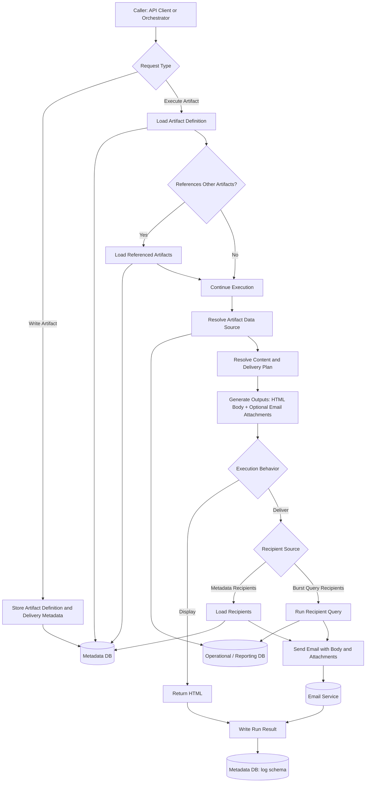

# BCI Query Engine High-Level Flow

## Core Idea

The Query Engine has two main jobs:

1. Write artifact definitions and delivery configuration into the metadata database.
2. Execute artifact definitions to produce display output or delivery output.

On the normal display path, artifact mode should come from metadata and the artifact should be received through a `GET` request.

An artifact is a metadata-backed definition that describes:

1. its data source
2. content or template references
3. artifact references
4. output formats
5. execution behavior

Most artifacts are HTML-first. Display output is HTML by default. Execution
requests can also ask Query Engine to generate PDF file outputs; XLSX, CSV, and
TXT remain future output formats.
Delivery should be treated as a function over an artifact, not as a separate content type.

## Functional Flow

## Coherent Model

1. A write request stores artifact definitions and delivery configuration in metadata.
2. A display request should retrieve the artifact through `GET`, with behavior determined by the artifact definition in metadata.
3. The artifact itself owns the source definition the query engine uses to query the database.
4. Data queries run before content resolution.
5. A display call returns HTML.
6. A delivery call can reference another artifact, render it, and send the rendered result.
7. Recipient addresses can come from metadata or from a burst query against the database.
8. Once execution finishes, the engine writes the result to the log schema in the metadata database.

## Request Semantics

1. `GET` makes sense for receiving a display artifact.
2. `POST` makes sense for writing artifacts or creating an artifact execution request.
3. A normal display retrieval path should not require a `mode` query parameter.
4. Route names should not decide `deliver`, `run`, or `render`; that behavior belongs in the artifact definition.

## Metadata Boundary

1. The `app` schema stores artifact definitions, templates, artifact references, delivery configuration, and static recipient configuration.
2. The `security` schema exists in the metadata database but is intentionally out of scope for the current functional design pass.
3. The `log` schema stores run history and the resolved delivery details used for each execution.

## Working Assumptions For Now

1. Security and access control are intentionally deferred in this design pass.
2. HTML is the display payload. PDF is available as an explicit generated file
   output. XLSX, CSV, and TXT are still future output formats.
3. Artifact references are valid, resolvable, and non-cyclic.
4. Delivery and display are separate behaviors, even when they reuse the same rendered content.
5. Execution logging lives in the metadata database.
